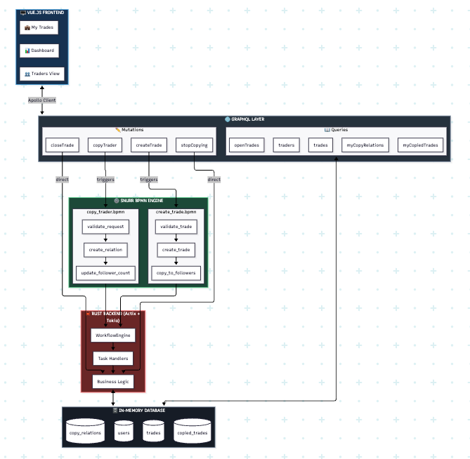

# CopyTrade POC — BPMN Workflow Automation in Rust

A weekend proof-of-concept exploring declarative business process orchestration using BPMN 2.0 in a Rust backend.
## Stack

| Layer | Tech |
|-------|------|
| Backend | Rust (Actix-web, Tokio, async-graphql) |
| Frontend | Vue 3 (Composition API, Apollo Client) |
| API | GraphQL |
| Workflow | Snurr BPMN Engine |

## Architecture

```
Vue.js → GraphQL API → Snurr BPMN Engine → Business Logic → In-Memory DB
```


## BPMN Workflows

| File | Flow |
|------|------|
| `copy_trader.bpmn` | Validate → Create Relation → Update Stats |
| `create_trade.bpmn` | Validate → Create Trade → Auto-copy to Followers |

## Key Takeaway

Business logic lives in BPMN diagrams (created via bpmn.io). Rust handlers execute each task. Change the flow without refactoring code.

## Run
```bash
# Backend
cd backend && cargo run

# Frontend
cd frontend && npm install && npm run dev
```

## Endpoints

- GraphQL Playground: `http://localhost:8080/playground`
- Frontend: `http://localhost:3000`

## Limitations

POC only — in-memory storage, no auth, no WebSockets.

## Resources

- BPMN Editor: https://demo.bpmn.io/new
- Snurr: https://crates.io/crates/snurr
- Snurr GitHub: https://github.com/sajox/snurr